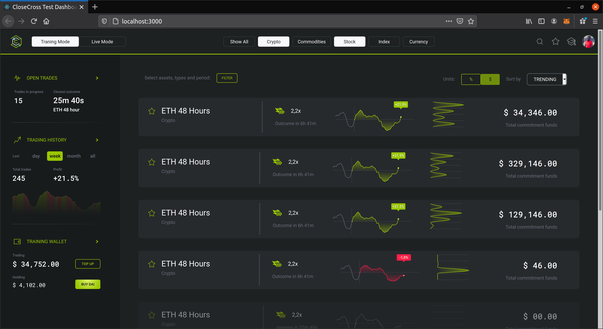

# CloseCross Interview test task - Karthick Venkatesan

Reposotiry created for CloseCross Interview test Task.

## Tech stack
- React
- Sass
- React-Bootstrap

## Steps to run the project

In the project directory, you can run:

- `$npm install`
- `$npm start`

Runs the app in the development mode.\
Open [http://localhost:3000](http://localhost:3000) to view it in the browser.

## Preview 
** left side bar is not implemented yet. Current version has static iamge.

